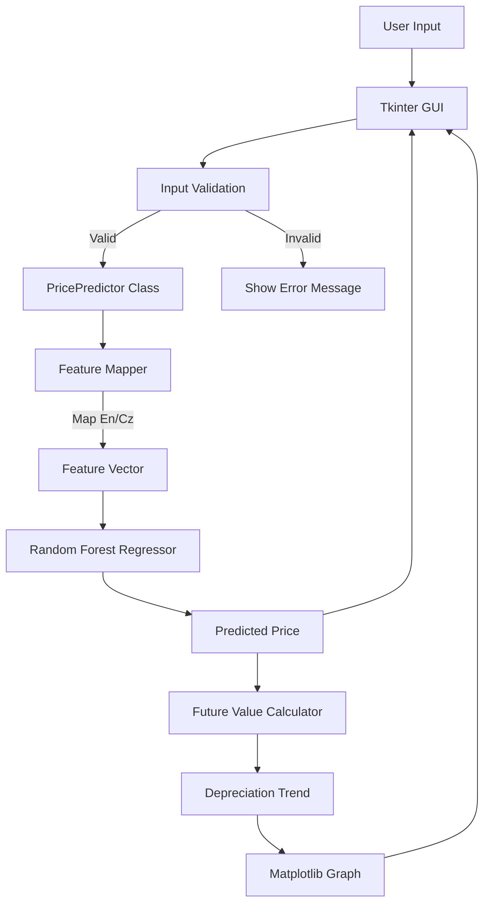

# Car Market Analyzer - Project Documentation

## 1. Project Overview
The **Car Market Analyzer** is a desktop application designed to estimate the market price of used cars based on real-world data scraped from Czech marketplaces (Sauto.cz). It provides users with instant price predictions and visualizes future value depreciation trends for the next 5 years.

### Design Goals
- **Accuracy**: Provide realistic price estimates based on year, mileage, brand, fuel, and transmission.
- **Portability**: Run without an IDE or complex setup on standard school computers.
- **Modularity**: Clean separation between data collection, model training, and the user interface.

---

## 2. Design Proposal & Analysis

### Why Random Forest?
We chose the **Random Forest Regressor** over Linear Regression or Neural Networks for several reasons:
- **Handling Non-Linearity**: Car depreciation is not purely linear (e.g., new cars lose value faster). Random Forest handles these non-linear relationships well.
- **Robustness**: It is less prone to overfitting than a single Decision Tree.
- **Category Handling**: It works effectively with One-Hot Encoded categorical variables (Brand, Fuel, Transmission).

### Why Tkinter?
- **Standard Library**: Tkinter is built into Python, ensuring the app runs on any school computer with Python installed, without needing heavy dependencies like PyQt or external web servers.
- **Simplicity**: Sufficient for the required form-based input and static graph display.

### Data Analysis Insights
Based on the scraped dataset (>2000 records):
- **Mileage vs. Price**: Strong negative correlation.
- **Brand Impact**: Premium brands (Mercedes, BMW, Audi) retain value differently than economy brands (Dacia, Skoda).
- **Fuel Trends**: Hybrids and Electric vehicles show distinct pricing patterns compared to traditional combustion engines.

---

## 3. Implementation Details

The project is structured into three main components:

### A. Data Collection (`src/scraper/`)
- **Technology**: Selenium WebDriver.
- **Logic**: Handles pagination, cookie consent banners, and lazy loading to scrape listings from Sauto.cz.
- **Output**: Raw CSV data for processing.

### B. Machine Learning Model (`notebooks/` & `src/model/`)
- **Preprocessing**: Cleaning raw text (e.g., "Diesel" -> "Nafta"), parsing numerical values, and One-Hot Encoding categorical features.
- **Training**: `RandomForestRegressor` from Scikit-Learn.
- **Persistence**: The trained model and column structure are saved as `.pkl` files using `joblib`.

### C. Application Logic (`src/app/` & `src/model/inference.py`)
- **Decoupling**: The prediction logic is isolated in `PricePredictor` class (`src/model/inference.py`).
- **GUI**: `gui_app.py` handles user interaction.
- **Graphing**: Matplotlib is embedded in Tkinter to visualize depreciation trends.

### External Code Analysis
We evaluated the following repositories for potential reuse:
1.  **`image-processing-pipeline`**: Focused on image validation/processing. **Result**: Not used (Project deals with tabular data).
2.  **`library-inventory-manager`**: A Flask-based web app with SQL database. **Result**: Not used (Project is a local desktop app with different architecture).
3.  **`P2P-team-project`**: Written in C#/.NET. **Result**: Not used (Incompatible technology stack).

### D. Localization & Validation
-   **Czech Localization**: The entire application (GUI, internal logic, and configuration) is localized to Czech to match the source data from Sauto.cz.
-   **Robust Validation**: Inputs are validated against `model_metadata.json`, which contains a complete map of valid Brand-Fuel-Transmission combinations derived from the training data. This prevents invalid queries (e.g., "Tesla Diesel") from reaching the model.

## 4. Testing Strategy

### Unit Testing
We implemented `unittest` cases in `tests/test_inference.py` to verify:
- **Input Validation**: Ensuring years and mileage are within realistic bounds.
- **Model Integration**: Verifying that the `PricePredictor` correctly loads the model.
- **Feature Mapping**: Confirming that English inputs (e.g., "Petrol") are correctly mapped to model specific columns (e.g., `fuel_Nafta` or Reference).

### Manual Verification
- **Scenario Testing**: We ran `reproduce_issue.py` to confirm that distinct inputs (e.g., LPG vs Petrol) produce distinct outputs, fixing a critical bug where they were previously identical.
- **UI Testing**: Verified that the graph displays the correct year range (2026-2030) and that buttons are readable.

---

## 5. How to Run

### Prerequisites
- Python 3.8+
- Dependencies listed in `requirements.txt`

### steps
1.  **Install Dependencies**:
    ```bash
    pip install -r requirements.txt
    ```
2.  **Run the Application**:
    ```bash
    python src/app/gui_app.py
    ```

---

## 6. Program Flow


